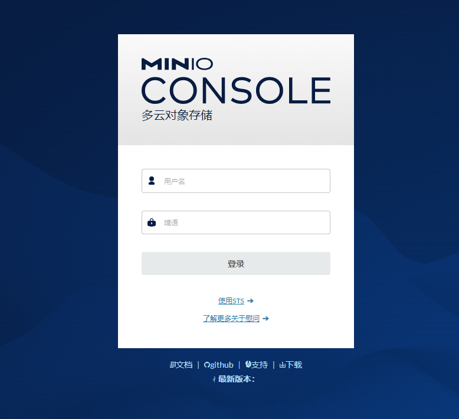
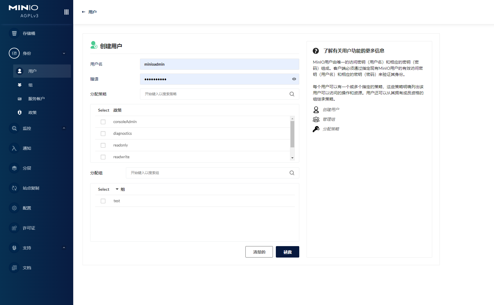
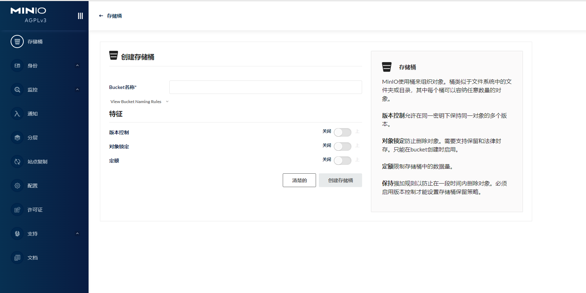
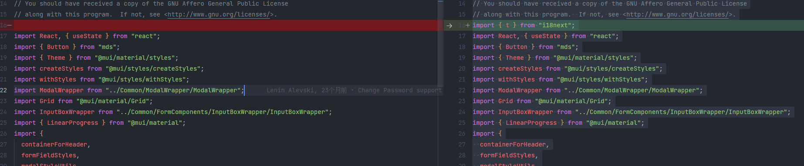
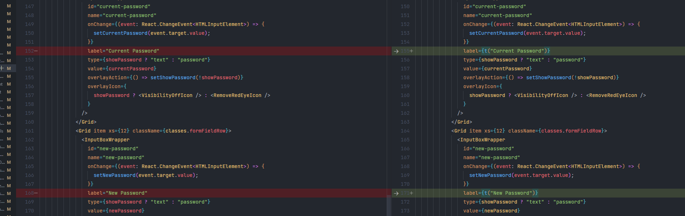
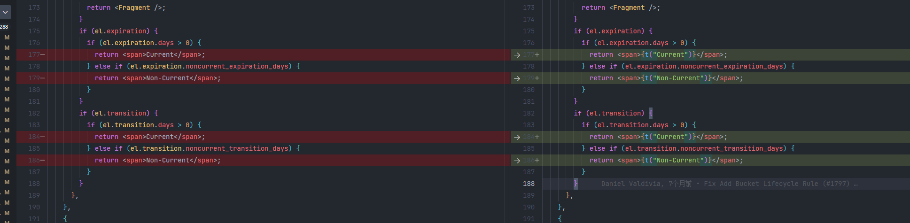

# 将 `MinIo` 的 `portal-ui` 中的代码进行自动国际化的脚本

[English Doc](./readme_en.md)

使用这个脚本可以自动对 `minio` 的前端代码中的字符添加国际化

使用此脚本可以对 `minio-console` 中大约 90% 的代码自动添加国际化处理，共处理 280+ 文件

下面是汉化后的截图






使用前

```jsx
import React from 'react';

export default function Login() {
  return (
    <Button
      label='login label'
      type='submit'
    >
      login
    </Button>
  );
}
```

使用后

```jsx
import { t } from 'i18next';
import React from 'react';

export default function Login() {
  return (
    <Button
      label={t('login label')}
      type='submit'
    >
      {t('login')}
    </Button>
  );
}
```

## 使用方法

### 1. `minio` 仓库代码改造，添加国际化依赖

1. 切换到 `minio` 的仓库下，安装 `i18next`

```
yarn add i18next
```

2. 修改 `/portal-ui/src/index.tsx`文件 初始化 `i18next`

```tsx
import i18next from 'i18next';

i18next
  .init({
    lng: 'en', // if you're using a language detector, do not define the lng option
    debug: true,
    nsSeparator: false,
    keySeparator: false,
    fallbackLng: false,
    resources: {
      en: {
        translation: {},
      },
    },
  })
  .then(() => {
    const root = ReactDOM.createRoot(document.getElementById('root') as HTMLElement);
    root.render(
      <React.StrictMode>
        <Provider store={store}>
          <StyleHandler>
            <MainRouter />
          </StyleHandler>
        </Provider>
      </React.StrictMode>
    );
  });
```

2. 将上面的修改部分提交 commit

```
git commit -m 'feat: init i18next'
```

### 3. clone 这个仓库

```
git clone https://github.com/lvyueyang/minio-console-i18n.git
```

### 4. 安装依赖

```
yarn
```

### 5. 配置目标路径

修改 `uiSrcDir` 中的相对路径，为 `minio` 前端仓库的路径，如果是和 minio 仓库同级则不需要配置这个路径

> 下面的正则是为了兼容在 windows 下执行时的路径格式

```js
// src/config.mjs
export const uiSrcDir = path
  .join(__dirname, '../../minio-console/portal-ui/src/')
  .replace(/\\/g, '/');
```

### 6. 执行脚本，对 portal-ui/src 下的文件添加国际化代码

```
npm run all
```

等待命令执行完成后可以通过 `git diff` 查看 `portal-ui/src` 的文件变化






### 7. 引入国际化文件

脚本执行完成后，会生成 `dist/i18n/log.json` 文件，将此文件拷贝至 `portal-ui/src` 下，后续会根据此文件进行语言翻译即可

引入后修改步骤 2 中的代码 `/portal-ui/src/index.tsx`

> 如果需要翻译为其他语言，这一步是必须做的

```tsx
import i18next from 'i18next';
import en from './lang_en.json';

i18next
  .init({
    lng: 'en', // if you're using a language detector, do not define the lng option
    debug: true,
    nsSeparator: false,
    keySeparator: false,
    fallbackLng: false,
    resources: {
      en: {
        translation: en,
      },
    },
  })
  .then(() => {
    const root = ReactDOM.createRoot(document.getElementById('root') as HTMLElement);
    root.render(
      <React.StrictMode>
        <Provider store={store}>
          <StyleHandler>
            <MainRouter />
          </StyleHandler>
        </Provider>
      </React.StrictMode>
    );
  });
```

## 脚本命令说明

### `npm start`

这个命令会针对 portal-ui/src 目录下面的 所有 tsx 文件进行国际化添加，这是最主要的命令，绝大多数的文件都是由这个命令来进行格式化的

### `npm run sp`

这个命令是针对一些特殊的文件进行进行精确处理。
例如：`portal-ui/src/screens/Console/valid-routes.ts`，针对菜单列表的配置项进行处理


### `npm run ext`

遍历 `portal-ui/src`下的所有文件，提取 t("key") 中的 key，并生成`dist/i18n/log.json` 和 `dist/i18n/en.json` 文件

`log.json` 文件是执行时的日志文件

`en.json` 文件是根据 `log.json` 生成的国际化资源文件

### `npm run cwl`

对代码进行 `transformCode` 后会添加/减少一些多余的换行，在 `git diff` 时影响 `Review`，很不美观
此脚本会对 diff 的文件进行对比，移除或添加那些换行符
目前需要在 transform 前先拷贝文件到 src/before 中

> 具体的使用和配置方式，请查看源码 一共 50 行

### `npm run zh`

这是调用翻译接口对 `lang_en.json` 进行翻译的脚本，翻译完成后会生成 `lang-zhCN.json` 文件

> 这个命令可以多次执行，翻译前会自动进行对比，不会重复翻译

## 相关链接

[i8next](https://www.i18next.com/)  
[i8next GitHub](https://www.i18next.com/)  
[babel](https://babeljs.io/)  
[minio-console](https://github.com/minio/console)  
参考文章  
[AST 搞定 i18n](https://guguji5.github.io/AST%E6%90%9E%E5%AE%9Ai18n/)
