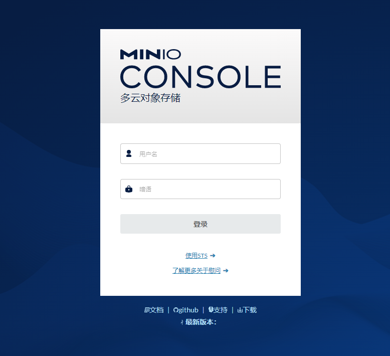
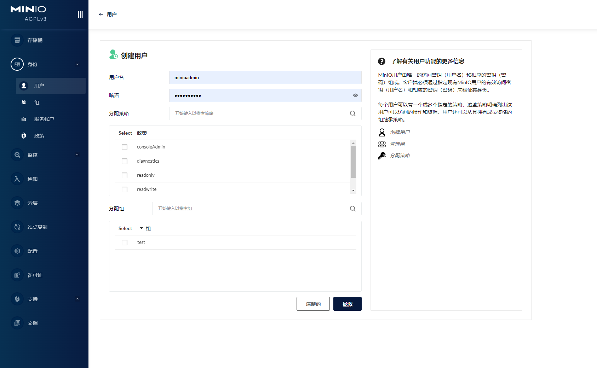
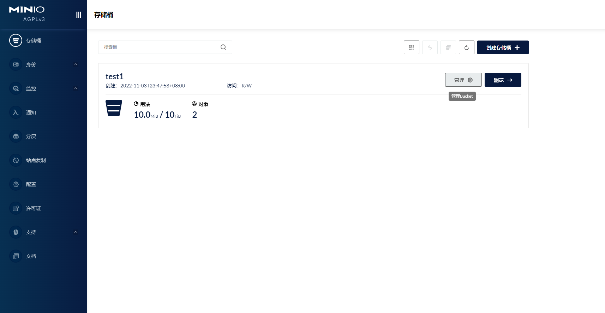
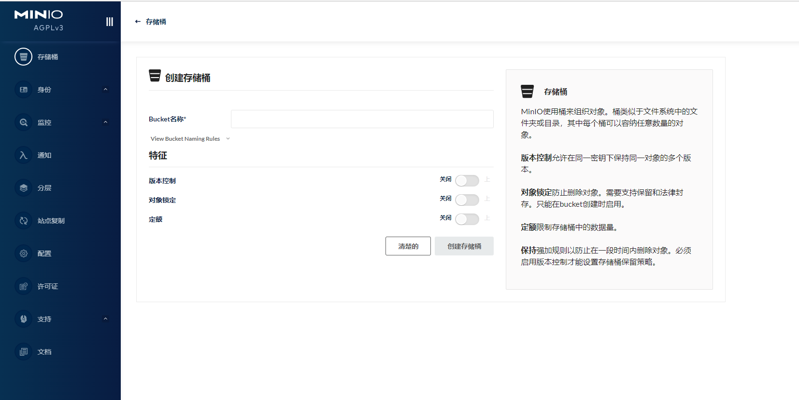
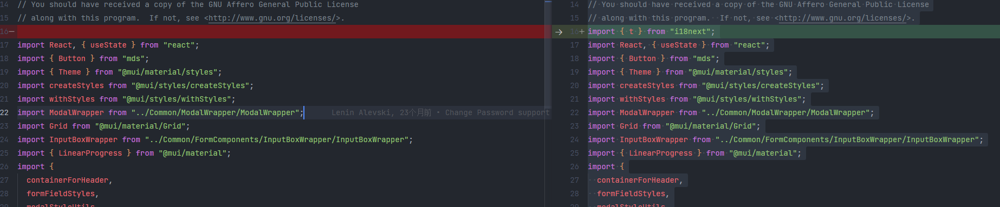
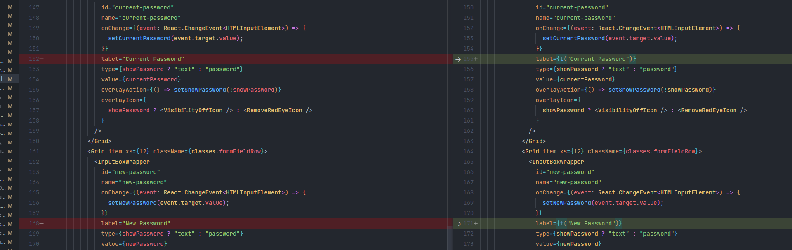
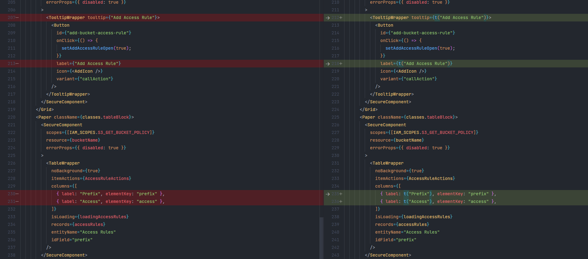
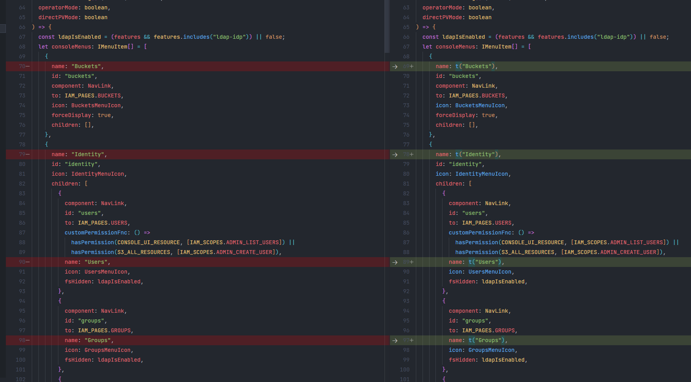

# Script to automatically internationalize code in `Portal-ui` of `MinIo`

[中文文档](./readme.md)

> My English is very poor. I'm sorry. This is a document that I translated by machine

Use this script to automatically internationalize characters in `minio` front-end code

Use this script to automatically add internationalization to about 90% of the code in `minio-console`, processing a total of 280+ files

Below is the screenshot after Chineseization






Before

```jsx
import React from 'react'

export default function Login() {
  return (
    <Button label='login label' type='submit'>
      login
    </Button>
  )
}
```

After

```jsx
import { t } from 'i18next'
import React from 'react'

export default function Login() {
  return (
    <Button label={t('login label')} type='submit'>
      {t('login')}
    </Button>
  )
}
```

## Instructions

### 1. `minio` warehouse code transformation, adding internationalization dependencies

1. Switch to the `minio` repository and install `i18next`

```
yarn add i18next
```

2. Modify `/portal-ui/src/index.tsx` file initialization `i18next`

```tsx
import i18next from 'i18next'

i18next
  .init({
    lng: 'en',
    debug: true,
    nsSeparator: false,
    keySeparator: false,
    fallbackLng: false,
    resources: {
      en: {
        translation: {},
      },
    },
  })
  .then(() => {
    const root = ReactDOM.createRoot(
      document.getElementById('root') as HTMLElement
    )
    root.render(
      <React.StrictMode>
        <Provider store={store}>
          <StyleHandler>
            <MainRouter />
          </StyleHandler>
        </Provider>
      </React.StrictMode>
    )
  })
```

2. Submit the modified part above

```
git commit -m 'feat: init i18next'
```

### 3. clone this repository

```
git clone https://github.com/lvyueyang/minio-console-i18n.git
```

### 4. Install package

```
yarn
```

### 5. Configure Target Path

Modify the relative path in `uiSrcDir` to the path of the `minio` front-end warehouse. If it is the same level as the minio warehouse, you do not need to configure this path

> The following rules are to be compatible with the path format when executing under Windows

```js
// src/config.mjs
export const uiSrcDir = path
  .join(__dirname, '../../minio-console/portal-ui/src/')
  .replace(/\\/g, '/')
```

### 6. Execute the script and add internationalization code to the file under `portal-ui/src`

```
npm run all
```

After waiting for the command execution to complete, you can view the file changes of `portal-ui/src` through `git diff`






### 7. Introduce internationalized files

After the script is executed, the `lang_log.json` file will be generated in the project root directory, and this file will be copied to `portal-ui/src`, and then the language translation will be performed according to this file.

Modify the code in step 2 after importing `/portal-ui/src/index.tsx`

> This step is required if translation into other languages is required

```tsx
import i18next from 'i18next'
import en from './lang_en.json'

i18next
  .init({
    lng: 'en',
    debug: true,
    nsSeparator: false,
    keySeparator: false,
    fallbackLng: false,
    resources: {
      en: {
        translation: en,
      },
    },
  })
  .then(() => {
    const root = ReactDOM.createRoot(
      document.getElementById('root') as HTMLElement
    )
    root.render(
      <React.StrictMode>
        <Provider store={store}>
          <StyleHandler>
            <MainRouter />
          </StyleHandler>
        </Provider>
      </React.StrictMode>
    )
  })
```

## Script command description

### `npm start`

This command will add internationalization to all tsx files under the portal-ui/src directory. This is the most important command. Most of the files are formatted by this command.

### `npm run sp`

This command is for precise processing of some special files.
For example: `portal-ui/src/screens/Console/valid-routes.ts`, which is processed for the configuration items of the menu list



### `npm run ext`

Traverse all files under `portal-ui/src`, extract the key in t("key"), and generate `lang_log.json` and `lang_en.json` files

The `lang_log.json` file is the log file at execution time

The `lang_en.json` file is an internationalized resource file generated from `lang_log.json`

### `npm run all`

A collection of `npm start` `npm run sp` `npm run ext`, the first time you use this command, you can directly execute this command

### `npm run zh`

This is the script that calls the translation interface to translate `lang_en.json`. After the translation is completed, the `lang-zhCN.json` file will be generated

> This command can be executed multiple times, and the comparison will be performed automatically before translation, and the translation will not be repeated.

## Related Links

[i8next](https://www.i18next.com/)  
[i8next GitHub](https://www.i18next.com/)  
[babel](https://babeljs.io/)  
[minio-console](https://github.com/minio/console)  
参考文章  
[AST 搞定 i18n](https://guguji5.github.io/AST%E6%90%9E%E5%AE%9Ai18n/)
